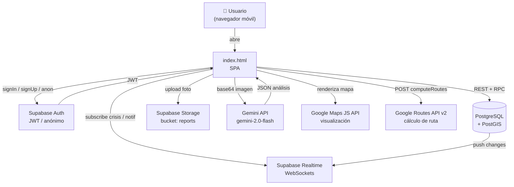
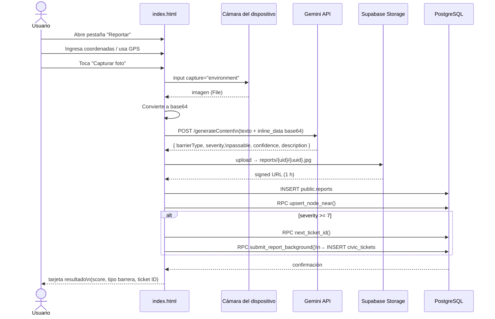
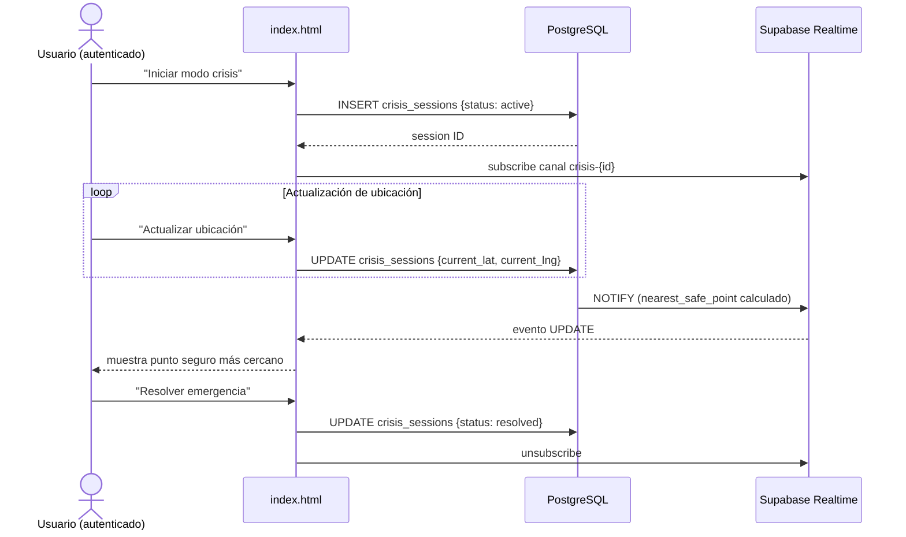
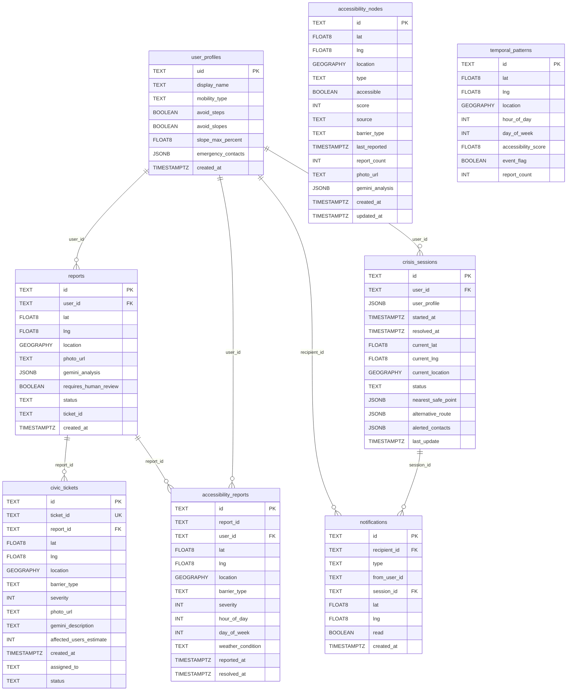
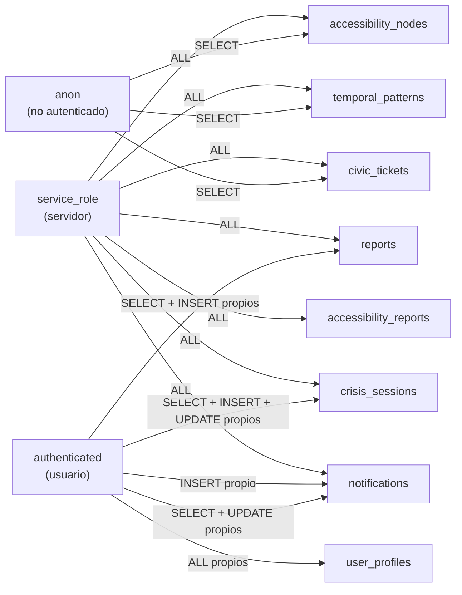
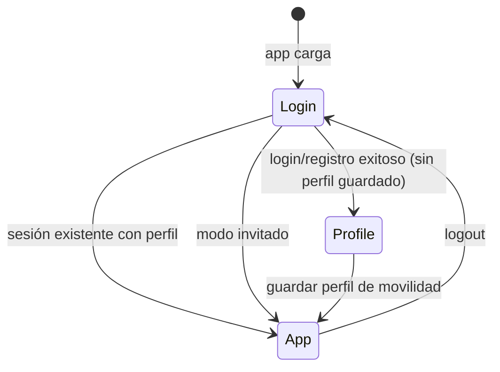

# Paso — Documentación Técnica

> Plataforma de ruteo accesible para Tijuana, México.
> Permite a personas con movilidad reducida reportar barreras peatonales, calcular rutas accesibles y activar un modo de emergencia.

---

## Índice

1. [Stack Tecnológico](#1-stack-tecnológico)
2. [Arquitectura del Sistema](#2-arquitectura-del-sistema)
3. [Estructura del Proyecto](#3-estructura-del-proyecto)
4. [Base de Datos](#4-base-de-datos)
   - [Diagrama ER](#diagrama-er)
   - [Tablas](#tablas)
   - [Índices](#índices)
5. [Stored Functions (RPCs)](#5-stored-functions-rpcs)
6. [Row Level Security (RLS)](#6-row-level-security-rls)
7. [Storage](#7-storage)
8. [Realtime](#8-realtime)
9. [Frontend (index.html)](#9-frontend-indexhtml)
   - [Pantallas](#pantallas)
   - [Funcionalidades](#funcionalidades)
   - [Flujo de reporte con cámara](#flujo-de-reporte-con-cámara)
10. [Variables de entorno y claves](#10-variables-de-entorno-y-claves)
11. [Cómo correr el proyecto](#11-cómo-correr-el-proyecto)

---

## 1. Stack Tecnológico

| Capa | Tecnología | Notas |
|---|---|---|
| **Frontend** | HTML5 + CSS3 + Vanilla JS | SPA sin framework, todo en `index.html` |
| **Base de datos** | PostgreSQL 15 + PostGIS | Hosteado en Supabase |
| **Auth** | Supabase Auth | Email/password, anónimo, JWT |
| **Storage** | Supabase Storage | Bucket `reports` (imágenes de barreras) |
| **Realtime** | Supabase Realtime (WebSockets) | Modo crisis y notificaciones |
| **Mapas** | Google Maps JS API | Visualización de rutas |
| **Ruteo** | Google Routes API v2 | Cálculo de ruta peatonal |
| **Análisis de imagen** | Gemini API (`gemini-2.0-flash`) | Clasificación de barreras desde fotos |
| **Geoespacial** | PostGIS `geography(POINT, 4326)` | Índices GIST, ST_DWithin, ST_Distance |
| **CI/deploy** | — | Actualmente sin pipeline; archivo estático servible con cualquier servidor HTTP |

---

## 2. Arquitectura del Sistema



### Flujo de reporte ciudadano



### Flujo de Modo Crisis



---

## 3. Estructura del Proyecto

```
Paso/
├── backend-dev/
│   ├── backend/
│   │   ├── public/
│   │   │   ├── index.html          # SPA completa (auth + mapa + paneles)
│   │   │   ├── supabase-config.js  # cliente Supabase (ESM, no usado en SPA actual)
│   │   │   └── config.example.js   # plantilla de claves públicas
│   │   ├── seed/
│   │   │   ├── supabase-seed.js    # seed de nodos de accesibilidad
│   │   │   ├── users-seed.js       # seed de usuarios de prueba
│   │   │   ├── field-captures.json
│   │   │   └── estimated-nodes.json
│   │   ├── package.json
│   │   └── .env.example
│   ├── supabase-schema.sql         # migración completa (fuente de verdad)
│   ├── skills/                     # skills de Claude para cada módulo
│   │   ├── paso-routing-engine/
│   │   ├── paso-ruta-viva/
│   │   ├── paso-modo-crisis/
│   │   ├── paso-puente-ciudadano/
│   │   ├── paso-navegador-voz/
│   │   └── paso-seed-data/
│   └── README.md
└── DOCS.md                         # este archivo
```

---

## 4. Base de Datos

**Proyecto Supabase:** `PON TU API KEY AQUI`
**Extensiones requeridas:** `postgis`, `uuid-ossp`

Todas las columnas `location` son de tipo `GEOGRAPHY(POINT, 4326)` y se generan automáticamente a partir de `lat`/`lng` — nunca se insertan manualmente.

### Diagrama ER



### Tablas

#### `public.accessibility_nodes`
Nodos del grafo de accesibilidad urbana. Son el corazón del sistema de ruteo.

| Columna | Tipo | Descripción |
|---|---|---|
| `id` | TEXT PK | UUID generado automáticamente |
| `lat` / `lng` | FLOAT8 | Coordenadas geográficas |
| `location` | GEOGRAPHY | Generada desde lat/lng (STORED) |
| `type` | TEXT | Tipo de nodo (`sidewalk`, etc.) |
| `accessible` | BOOLEAN | Si el punto es accesible |
| `score` | INT (0–10) | Puntuación de accesibilidad |
| `source` | TEXT | `field_verified` \| `estimated` |
| `barrier_type` | TEXT | Tipo de barrera detectada |
| `report_count` | INT | Veces que se ha reportado este nodo |
| `gemini_analysis` | JSONB | Respuesta cruda de Gemini |

#### `public.reports`
Reportes individuales enviados por ciudadanos.

| Columna | Tipo | Descripción |
|---|---|---|
| `id` | TEXT PK | UUID |
| `user_id` | TEXT | UID de Supabase Auth |
| `photo_url` | TEXT | URL firmada en Storage (1 h) |
| `gemini_analysis` | JSONB | `{ barrierType, severity, passable, confidence, description }` |
| `requires_human_review` | BOOLEAN | `true` si `confidence < 0.6` |
| `status` | TEXT | `pending` \| `reviewed` \| `resolved` |
| `ticket_id` | TEXT | Referencia a `civic_tickets.ticket_id` si `severity >= 7` |

#### `public.accessibility_reports`
Vista analítica de reportes, enriquecida con dimensiones temporales para BI.

| Columna | Tipo | Descripción |
|---|---|---|
| `report_id` | TEXT | Referencia al reporte original |
| `hour_of_day` | INT (0–23) | Hora local (Tijuana, extraída en inserción) |
| `day_of_week` | INT (0–6) | 0 = lunes, 6 = domingo |
| `weather_condition` | TEXT | Condición climática (opcional) |
| `resolved_at` | TIMESTAMPTZ | NULL hasta resolución |

#### `public.temporal_patterns`
Serie histórica de accesibilidad por zona, hora y día. Alimenta el módulo **Ruta Viva**.

| Columna | Tipo | Descripción |
|---|---|---|
| `hour_of_day` | INT | Hora local (0–23) |
| `day_of_week` | INT | Día de semana (0–6) |
| `accessibility_score` | FLOAT8 (0–1) | 0 = completamente inaccesible, 1 = accesible |
| `event_flag` | BOOLEAN | Hay evento especial en ese horario |
| `report_count` | INT | Reportes históricos que sustentan el score |

Zonas con datos seed:
- Mercado Hidalgo `(32.5266, -117.0382)`
- Zona Centro / Av. Revolución `(32.5322, -117.0281)`
- Hospital General de Tijuana `(32.5193, -117.0289)`
- Plaza Río `(32.5258, -117.0327)`
- Parque Morelos `(32.5301, -117.0197)`

#### `public.civic_tickets`
Tickets formales generados automáticamente cuando `severity >= 7`. Destinados al municipio.

| Columna | Tipo | Descripción |
|---|---|---|
| `ticket_id` | TEXT UNIQUE | Formato `PASO-YYYY-NNNN` (generado por `next_ticket_id()`) |
| `report_id` | TEXT FK | Reporte que lo originó |
| `status` | TEXT | `open` \| `assigned` \| `resolved` |
| `assigned_to` | TEXT | Nombre del responsable municipal |
| `affected_users_estimate` | INT | Estimación de usuarios afectados |

#### `public.crisis_sessions`
Sesiones de emergencia activas. Habilitadas para Realtime.

| Columna | Tipo | Descripción |
|---|---|---|
| `user_profile` | JSONB | `{ mobility_type }` snapshot al momento del inicio |
| `nearest_safe_point` | JSONB | Calculado por el sistema cuando cambia la ubicación |
| `alerted_contacts` | JSONB | Lista de contactos de emergencia notificados |
| `status` | TEXT | `active` \| `resolved` |

#### `public.user_profiles`
Perfil de movilidad del usuario, persiste entre sesiones.

| Columna | Tipo | Descripción |
|---|---|---|
| `uid` | TEXT PK | Mismo UID que `auth.uid()` |
| `mobility_type` | TEXT | `wheelchair` \| `elderly` \| `cane` \| `stroller` \| `none` |
| `slope_max_percent` | FLOAT8 | Pendiente máxima tolerable (default 8%) |
| `emergency_contacts` | JSONB | Array de contactos de emergencia |

#### `public.notifications`
Notificaciones para el modo crisis (alertar contactos de emergencia).

| Columna | Tipo | Descripción |
|---|---|---|
| `recipient_id` | TEXT | UID del destinatario |
| `type` | TEXT | Tipo de notificación |
| `session_id` | TEXT | Crisis session asociada |
| `read` | BOOLEAN | Si el destinatario la leyó |

### Índices

| Índice | Tabla | Tipo | Propósito |
|---|---|---|---|
| `idx_nodes_location` | `accessibility_nodes` | GIST | Queries geoespaciales de nodos |
| `idx_reports_location` | `reports` | GIST | Reportes cercanos |
| `idx_crisis_location` | `crisis_sessions` | GIST | Punto seguro más cercano |
| `idx_ar_location` | `accessibility_reports` | GIST | Analítica geoespacial |
| `idx_tp_location` | `temporal_patterns` | GIST | Ruta Viva (`ST_DWithin`) |
| `idx_tickets_location` | `civic_tickets` | GIST | Mapa municipal |
| `idx_tp_hour_dow` | `temporal_patterns` | B-Tree | Filtro hora + día (compuesto) |
| `idx_reports_user_created` | `reports` | B-Tree | Historial por usuario |
| `idx_tickets_status` | `civic_tickets` | B-Tree | Panel de tickets abiertos |
| `idx_notif_recipient_read` | `notifications` | B-Tree | Notificaciones no leídas |

---

## 5. Stored Functions (RPCs)

Todas se invocan desde el cliente como `sb.rpc('nombre', { params })`.

| Función | Argumentos | Retorna | Descripción |
|---|---|---|---|
| `nodes_in_bbox` | `p_lat_min, p_lat_max, p_lng_min, p_lng_max` | `SETOF accessibility_nodes` | Nodos dentro de un bounding box. Usado para scoring de ruta. |
| `nearest_node` | `p_lat, p_lng, p_radius_m` | `TABLE (node + distance_m)` | Nodo más cercano con distancia. Máximo 1 resultado. |
| `upsert_node_near` | `p_lat, p_lng, p_radius_m, p_type, p_accessible, p_score, p_barrier_type, p_photo_url, p_gemini_analysis, p_source` | `accessibility_nodes` | Atómico: actualiza el nodo más cercano si existe en el radio, o crea uno nuevo. Usa `FOR UPDATE` para evitar race conditions. |
| `recent_reports_near` | `p_lat, p_lng, p_radius_m, p_window_seconds` | `TABLE (gemini_analysis, created_at)` | Reportes recientes en un radio + ventana de tiempo. Usado en Ruta Viva. |
| `ruta_viva_history` | `p_lat, p_lng, p_hour, p_dow, p_radius_m` | `TABLE (avg_score, data_points, has_event)` | Score histórico promedio para una zona + hora + día. |
| `next_ticket_id` | — | `TEXT` | Genera el siguiente ticket ID (`PASO-YYYY-NNNN`) usando `ticket_seq`. Atómico. |
| `submit_report_background` | `p_report_id, p_uid, p_lat, p_lng, p_barrier_type, p_severity, p_hour, p_dow, ...` | `VOID` | `SECURITY DEFINER`. Inserta en `accessibility_reports` y opcionalmente en `civic_tickets`. El cliente lo llama fire-and-forget. |

### Lógica de Ruta Viva (combinada en el cliente)

```
score_final = avg_score_histórico * 0.7
            + score_reportes_recientes * 0.3

Si data_points < 3 → no se aplica Ruta Viva
Si hay reportes recientes → penaliza el score
Resultado se cachea en memoria 30 minutos
```

---

## 6. Row Level Security (RLS)

RLS habilitado en todas las tablas. Resumen de políticas:



| Tabla | anon | authenticated | service_role |
|---|---|---|---|
| `accessibility_nodes` | SELECT | — | ALL |
| `reports` | — | SELECT/INSERT (propios) | ALL |
| `accessibility_reports` | — | — | ALL |
| `temporal_patterns` | SELECT | — | ALL |
| `civic_tickets` | SELECT | — | ALL |
| `crisis_sessions` | — | SELECT/INSERT/UPDATE (propios) | ALL |
| `user_profiles` | — | ALL (propios) | ALL |
| `notifications` | — | SELECT/UPDATE/INSERT (propios) | ALL |

---

## 7. Storage

**Bucket:** `reports` (privado)

| Política | Quién | Operación | Condición |
|---|---|---|---|
| `reports_upload_own` | authenticated | INSERT | Solo a su carpeta `reports/{uid}/`, max 10 MB, solo `image/*` |
| `reports_read_auth` | authenticated | SELECT | Cualquier imagen del bucket |

Las URLs se generan como **signed URLs** con expiración de 1 hora (`createSignedUrl`).

---

## 8. Realtime

Tablas habilitadas en `supabase_realtime`:

| Tabla | Evento escuchado | Quién suscribe | Para qué |
|---|---|---|---|
| `crisis_sessions` | `UPDATE` | Usuario en crisis | Recibir `nearest_safe_point` calculado |
| `notifications` | `INSERT` | Contactos de emergencia | Alertas en tiempo real |

Canal de crisis: `crisis-{session_id}`
Filtro: `id=eq.{crisisId}`

---

## 9. Frontend (index.html)

SPA de archivo único. Cero dependencias de build — se sirve con cualquier servidor HTTP estático.

### Pantallas



### Funcionalidades

| Pestaña | Función | APIs usadas |
|---|---|---|
| **Ruta** | Calcular ruta peatonal accesible entre dos puntos | Google Routes API, `nodes_in_bbox()`, `ruta_viva_history()` |
| **Reportar** | Capturar foto con cámara, analizar con Gemini, guardar reporte | Gemini API, Supabase Storage, `upsert_node_near()`, `submit_report_background()` |
| **Ruta Viva** | Predecir accesibilidad en una zona a una hora específica | `ruta_viva_history()`, `recent_reports_near()` |
| **Crisis** | Activar modo emergencia, compartir ubicación en tiempo real | Supabase Realtime, `crisis_sessions` |

### Flujo de reporte con cámara

La captura de foto usa `capture="environment"` para forzar la cámara trasera del dispositivo y no permitir selección de galería:

```html
<input type="file" accept="image/*" capture="environment">
```

El análisis con Gemini se realiza directamente desde el browser enviando la imagen en base64:

```
POST https://generativelanguage.googleapis.com/v1beta/models/gemini-2.0-flash:generateContent
Header: x-goog-api-key: {GEMINI_API_KEY}

Body:
{
  "contents": [{
    "parts": [
      { "text": "<prompt de clasificación>" },
      { "inline_data": { "mime_type": "image/jpeg", "data": "<base64>" } }
    ]
  }],
  "generationConfig": { "temperature": 0.1 }
}
```

Respuesta esperada de Gemini (JSON):

```json
{
  "barrierType": "broken_ramp | missing_ramp | no_curb_cut | broken_sidewalk | blocked_sidewalk | steep_slope | other | none",
  "severity": 1,
  "passable": true,
  "confidence": 0.9,
  "description": "descripción breve en español",
  "affectedProfiles": ["wheelchair"]
}
```

### Scoring de ruta

```
score_nodo = promedio ponderado de accessibility_nodes en el bbox de la ruta
  - fuente field_verified → peso 1.5
  - fuente estimated      → peso 1.0

score_final = score_nodo (si no hay Ruta Viva)
            = score_nodo * 0.6 + (rv_score * 10) * 0.4 (si hay Ruta Viva)

Umbrales por perfil de movilidad:
  wheelchair → alerta si score < 6
  elderly    → alerta si score < 4
  cane       → alerta si score < 3
  stroller   → alerta si score < 3
  none       → alerta si score < 2
```

---

## 10. Variables de entorno y claves

### `.env`

```env
SUPABASE_URL=PON TU API KEY AQUI
SUPABASE_ANON_KEY=          # Dashboard → Settings → API → anon public
SUPABASE_SERVICE_KEY=       # Dashboard → Settings → API → service_role (privada)
GEMINI_API_KEY=             # Google AI Studio → API Keys
GOOGLE_MAPS_API_KEY=        # Google Cloud Console → Maps JS API + Routes API
```

### Claves en `index.html` (públicas, hardcodeadas)

> Solo se incluyen claves seguras para el browser. **Nunca incluir `SUPABASE_SERVICE_KEY`** en el frontend.

| Clave | Descripción |
|---|---|
| `SUPABASE_URL` | Endpoint del proyecto Supabase |
| `SUPABASE_ANON_KEY` | Clave pública (anon), protegida por RLS |
| `GOOGLE_MAPS_API_KEY` | Restringir por dominio en Google Cloud Console |
| `GEMINI_API_KEY` | Restringir por IP/referrer en Google AI Studio |

---

## 11. Cómo correr el proyecto

### Frontend (único archivo, sin build)

```bash
cd ~/Desktop/Paso/backend-dev/backend/public
python3 -m http.server 8080
# → http://localhost:8080
```

O con Node.js:

```bash
npx serve .
```

### Seeds de base de datos

```bash
cd ~/Desktop/Paso/backend-dev/backend

# Nodos de accesibilidad estimados
node seed/supabase-seed.js

# Usuarios de prueba
node seed/users-seed.js
```

### Migración de base de datos

Ejecutar `supabase-schema.sql` en Supabase Dashboard → SQL Editor → New query.
El script es **idempotente** (`IF NOT EXISTS`, `CREATE OR REPLACE`, `DROP IF EXISTS`).

**Orden de ejecución:**
1. Extensiones (`postgis`, `uuid-ossp`)
2. Tablas con columnas `GENERATED ALWAYS AS`
3. Secuencia `ticket_seq`
4. Índices GIST y B-Tree
5. Stored functions (RPCs)
6. RLS y políticas
7. Storage policies
8. Realtime publication
9. Seed de `temporal_patterns`
